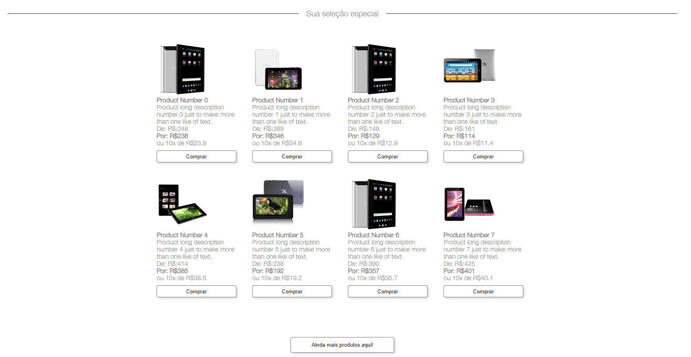

# :computer: Linx Impulse
Projeto react voltado para consumo de api de produtos.



## 	:open_file_folder: Pré-requisitos

- Node.js v.16.15.1
- NPM v.8.11.0

## :briefcase: Pacotes
- React
- Vite

## :heavy_check_mark: Instalação da aplicação

Clonando o repositório:

```
git clone https://github.com/igorsans/linx-impulse.git
```

Entrando na pasta:

```
cd linx-impulse
```

Instalando todos os pacotes:

```
npm install
```

Rodando o projeto:

```
npm run dev
```